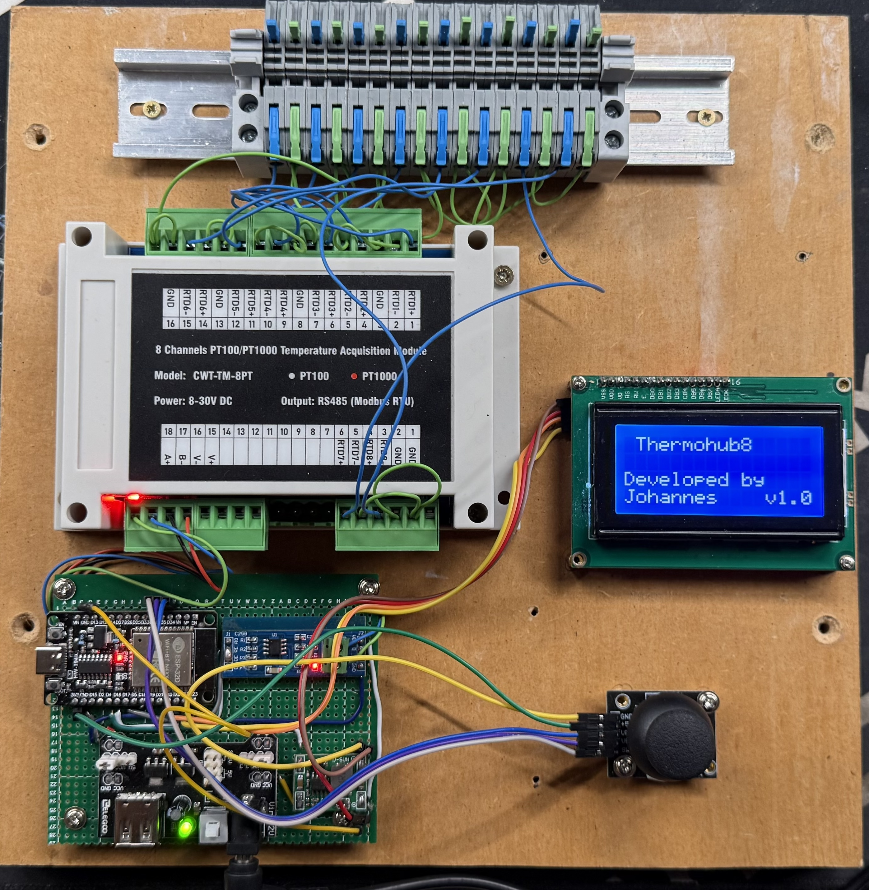

# ThermoHub8 – Open Source Modular Temperature Hub

ThermoHub8 is an open-source hardware and software project designed to connect **up to 8 temperature sensors** (via Modbus/RS-485) to an **ESP32** microcontroller.  
The device publishes all sensor readings through a **REST API** and integrates seamlessly with **Home Assistant** via a custom integration.

The goal of this project is to provide a **reliable, local, and customizable temperature monitoring system** for smart home and industrial environments — with **no cloud dependency**.



---

## 🧩 Project Overview

ThermoHub8 consists of three major parts:

1. **ESP32 Firmware**  
   - Communicates via Modbus (RS-485) with up to 8 PT1000 temperature sensors  
   - Serves a local REST API (`/api/v1/readings`)  
   - Includes a built-in web UI for naming sensors  
   - Displays readings on an LCD (16x4 I²C display)  
   - Supports joystick control for local navigation  

2. **Home Assistant Custom Integration**  
   - Polls the ThermoHub8 REST API  
   - Displays all 8 sensors as entities in Home Assistant  
   - Allows configuration via UI (Config Flow)  
   - Supports custom update intervals, API key, and SSL settings  

3. **Hardware Assembly**  
   - Based on ESP32 + MAX485 converter  
   - Uses Modbus PT1000 sensor modules  
   - LCD display and joystick for local display and control  
   - Powered via DC converter (e.g., 12V → 5V)

---

## 🔧 Components

| Component | Description | Notes / Links |
|------------|--------------|-----------------------------|
| **ESP32** | Main controller with Wi-Fi and serial interface | [https://de.aliexpress.com/item/1005007671225942.html] |
| **MAX485 module** | RS-485 transceiver for Modbus communication | [https://de.aliexpress.com/item/1005006090281569.html] |
| **PT1000 Modbus modules** | 8 temperature input converters (Modbus RTU) | [https://de.aliexpress.com/item/1005003116560748.html] |
| **Joystick module** | Analog joystick for navigation (X/Y via ADC) | [https://de.aliexpress.com/item/1005007070151087.html] |
| **LCD 16x4 I²C display** | Local temperature display, ATTENTION: please make sure to get the version WITH the IIC controller chip | [https://de.aliexpress.com/item/32550720999.html] |
| **DC power converter** | Converts 12V DC to 5V for ESP32 and peripherals, I would recommend to get something with a plug and maybe an on/pff switch | [https://de.aliexpress.com/item/1005007924460475.html] |
| **12V DC power supply** | Simple 12V power supply | [https://de.aliexpress.com/item/1005007264933490.html] |

> 💡 Add pictures or wiring diagrams here once available.  
> Suggested folder: `docs/images/`  
> Example: ``

---

## ⚙️ Features Summary

- 8 Modbus-connected temperature sensors (PT1000)
- REST API output for easy integration
- Web configuration UI for sensor naming
- LCD display with joystick navigation
- Full Home Assistant integration
- No cloud dependency
- Open hardware and open firmware
- Logging support via serial and Home Assistant

---

## 🧠 System Architecture

```
+------------------------+
| PT1000 Sensor Modules  |  (Modbus RTU)
+----------+-------------+
           |
           | RS-485 (A/B)
           |
     +-----+-----+
     |   MAX485  |
     +-----+-----+
           |
           | UART1 (RX=17, TX=16)
           |
       +---+-----+
       |  ESP32  |
       |         |        +-----+------+
       |         |--------| Joystick   |
       |         |        | x=34, Y=35 |
       |         |        +------------+
       |  - Reads Modbus
       |  - Hosts REST API
       |  - Runs Web UI
       |  - Updates LCD       
       +---+-----+
           |
           | I²C (SDA=21, SCL=22)
           |
     +-----+------+
     | LCD 16x4   |
     +------------+
```
## ⚡ Power distribution:
- The 12V get's connected to the **DC-DC step-down-converter** and to the **PT1000-Modbus-Module**.
- The **ESP32** and the **LCD-Display** both are connected to the 5V
- The **joystick** get's connected to the **3V** output of the ESP32. This is important, as the analog leves in the code are calibrated to these levels. Also with both running on 5V it seems to cause problems. 

---

## 🧰 Firmware

The firmware is written in **C++ (Arduino / ESP32)** and uses the following libraries:

- `ESPAsyncWebServer`
- `AsyncTCP`
- `ModbusMaster`
- `LiquidCrystal_I2C`
- `ArduinoJson`

### Features:
- Single Modbus slave (configurable ID)
- Reads 8 float values (32-bit) from 16 registers
- REST API endpoint: `/api/v1/readings`
- Web interface for naming sensors (`/`)
- Persistent storage via `Preferences` (NVS)
- LCD navigation with joystick input
- Logging via Serial output

Firmware source:  
`/firmware/thermohub8_esp32/`

Example JSON output:

```json
{
  "sensors": [
    { "id": 1, "name": "Living Room", "value": 21.3, "unit": "°C" },
    { "id": 2, "name": "Bedroom", "value": 19.8, "unit": "°C" }
  ],
  "ts": "2025-09-15T12:34:56Z"
}
```

---

## 🏠 Home Assistant Integration

A dedicated Home Assistant integration (`custom_components/thermohub8/`) is included.

### Key Features
- Auto-discovery of all 8 sensors  
- Adjustable polling interval (1–60 s)  
- Configurable base URL, SSL verification, and API key  
- Logging and diagnostics support  

Integration documentation:  
[`/homeassistant/README_ThermoHub8.md`](./homeassistant/README_ThermoHub8.md)

---

## 🔒 License

### 📜 MIT License

```
MIT License

Copyright (c) 2025 [Your Name]

Permission is hereby granted, free of charge, to any person obtaining a copy
of this software and associated documentation files (the "Software"), to deal
in the Software without restriction, including without limitation the rights
to use, copy, modify, merge, publish, distribute, sublicense, and/or sell
copies of the Software, and to permit persons to whom the Software is
furnished to do so, subject to the following conditions:

The above copyright notice and this permission notice shall be included in all
copies or substantial portions of the Software.

THE SOFTWARE IS PROVIDED "AS IS", WITHOUT WARRANTY OF ANY KIND, EXPRESS OR
IMPLIED, INCLUDING BUT NOT LIMITED TO THE WARRANTIES OF MERCHANTABILITY,
FITNESS FOR A PARTICULAR PURPOSE AND NONINFRINGEMENT. IN NO EVENT SHALL THE
AUTHORS OR COPYRIGHT HOLDERS BE LIABLE FOR ANY CLAIM, DAMAGES OR OTHER
LIABILITY, WHETHER IN AN ACTION OF CONTRACT, TORT OR OTHERWISE, ARISING FROM,
OUT OF OR IN CONNECTION WITH THE SOFTWARE OR THE USE OR OTHER DEALINGS IN THE
SOFTWARE.
```

---

## 🤝 Contributing

Pull requests are welcome!  
If you find a bug, have an idea, or want to improve the documentation, feel free to fork the repository and submit a PR.

---

## 🧩 To-Do / Roadmap

- [ ] PCB design for cleaner wiring  
- [ ] Optional OLED support  
- [ ] MQTT output mode  
- [ ] Configurable Modbus ID via web UI  
- [ ] OTA firmware updates  

---

## Disclaimer

Parts of the code and the documentation have been created with Claude.AI.
