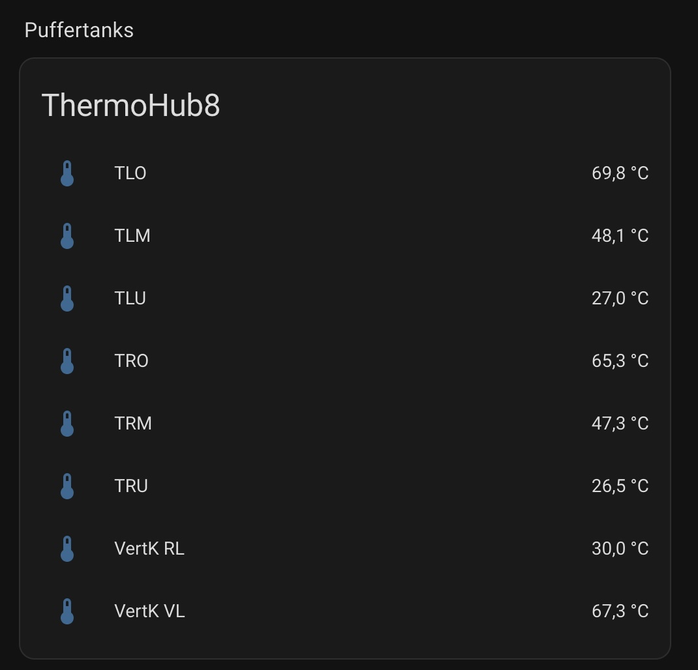

# ThermoHub8 – Home Assistant Custom Integration

The ThermoHub8 integration connects Home Assistant to a local REST endpoint that exposes up to **8 sensor readings** (e.g., temperatures). It uses Home Assistant’s **Config Flow**, a **DataUpdateCoordinator** for polling, and exposes entities under the `sensor` platform.

- **Domain:** `thermohub8`  
- **Integration type:** `hub` (local polling)  
- **Platforms:** `sensor`  
- **Max sensors:** 8  
- **I/O:** Local REST API (HTTP/HTTPS)  
- **IOT class:** `local_polling`




---

## Features

- UI-based setup (no YAML required).
- Polls a REST endpoint for a JSON payload containing up to 8 readings.
- Creates up to 8 `sensor` entities (missing sensors are optional placeholders until data arrives).
- Option to configure the **update interval**.
- Optional **API key** and **SSL verification** toggle.
- **Diagnostics** panel support to help with debugging.

---

## Requirements

- Home Assistant 2023.12+ (recommended).
- A reachable ThermoHub8 REST endpoint providing JSON at:
  ```
  GET /api/v1/readings
  ```

**Expected JSON schema (example):**
```json
{
  "sensors": [
    { "id": 1, "name": "Living Room", "value": 21.3, "unit": "°C" },
    { "id": 2, "name": "Bedroom",     "value": 19.8, "unit": "°C" }
  ],
  "ts": "2025-09-15T12:34:56Z"
}
```

- `sensors` is an array with up to 8 sensor objects.
- Each sensor includes `id` (1–8), `name` (string), `value` (number or `null`), and `unit` (string).
- `ts` is an ISO8601 timestamp.

---

## Installation

1. Copy the folder `custom_components/thermohub8/` into your Home Assistant `config` directory:

   ```
   <config>/
     custom_components/
       thermohub8/
         __init__.py
         manifest.json
         const.py
         api.py
         coordinator.py
         sensor.py
         config_flow.py
         diagnostics.py
         translations/
           en.json
           de.json
         strings.json
   ```

2. **Restart** Home Assistant.

3. Go to **Settings → Devices & Services → Add Integration**, search for **ThermoHub8**, and follow the prompts.

---

## Configuration (via UI)

During setup, you’ll be asked for:

- **Base URL** (required): e.g. `http://thermohub.local:8080`  
- **API key** (optional): if your endpoint requires Bearer auth  
- **Verify SSL** (optional, default `true`): set `false` for self-signed certs

After adding the integration, you can open **Options** to set:

- **Update interval (seconds)**: default `5` (range `1–60`)

---

## Entities

The integration creates up to **8** sensor entities:

```
sensor.thermohub8_sensor_1
sensor.thermohub8_sensor_2
...
sensor.thermohub8_sensor_8
```

- The **entity name**, **value**, and **unit** come from the REST payload.
- If fewer than 8 sensors are returned, the remaining entities are created as optional placeholders and remain `unknown` until values arrive.
- The timestamp `ts` is attached as an extra state attribute (`last_update`).

---

## Example Lovelace Cards

**Core cards (no HACS needed):**

```yaml
type: vertical-stack
cards:
  - type: grid
    columns: 4
    square: false
    cards:
      - type: sensor
        name: Sensor 1
        entity: sensor.thermohub8_sensor_1
        graph: line
      - type: sensor
        name: Sensor 2
        entity: sensor.thermohub8_sensor_2
        graph: line
      - type: sensor
        name: Sensor 3
        entity: sensor.thermohub8_sensor_3
        graph: line
      - type: sensor
        name: Sensor 4
        entity: sensor.thermohub8_sensor_4
        graph: line
      - type: sensor
        name: Sensor 5
        entity: sensor.thermohub8_sensor_5
        graph: line
      - type: sensor
        name: Sensor 6
        entity: sensor.thermohub8_sensor_6
        graph: line
      - type: sensor
        name: Sensor 7
        entity: sensor.thermohub8_sensor_7
        graph: line
      - type: sensor
        name: Sensor 8
        entity: sensor.thermohub8_sensor_8
        graph: line

  - type: history-graph
    title: ThermoHub8 – Last 24 Hours
    hours_to_show: 24
    entities:
      - sensor.thermohub8_sensor_1
      - sensor.thermohub8_sensor_2
      - sensor.thermohub8_sensor_3
      - sensor.thermohub8_sensor_4
      - sensor.thermohub8_sensor_5
      - sensor.thermohub8_sensor_6
      - sensor.thermohub8_sensor_7
      - sensor.thermohub8_sensor_8
```

---

## Logging

The integration uses standard HA logging via `_LOGGER`. To increase verbosity:

**Temporary (Developer Tools → Services → `logger.set_level`):**
```json
{
  "custom_components.thermohub8": "debug",
  "aiohttp": "warning"
}
```

**Persistent (`configuration.yaml`):**
```yaml
logger:
  default: info
  logs:
    custom_components.thermohub8: debug
    aiohttp: warning
```

Logs appear in `home-assistant.log` and in **Settings → System → Logs**.

---

## Troubleshooting

- **Cannot connect**
  - Verify the Base URL is reachable from the HA host.
  - If HTTPS with a self-signed cert, set **Verify SSL** to `false`.
  - Check if an **API key** is required and configured.

- **No sensor values / `unknown`**
  - Confirm the REST endpoint returns valid JSON with the keys shown above.
  - Ensure sensors carry `id` values in the range `1–8`.
  - Check the integration logs (set to `debug`).

- **Wrong units or names**
  - Units and names are taken from the payload; adjust your REST service to send the desired `unit` and `name` per sensor.

- **Performance**
  - Increase the **update interval** if your endpoint is resource-constrained.

---

## Development Notes

- Uses `DataUpdateCoordinator` to poll the REST endpoint on a fixed schedule.
- `sensor.py` dynamically builds entities based on the first successful payload.
- The `api.py` client supports an optional `Authorization: Bearer <token>` header.
- Diagnostics (`diagnostics.py`) provide a redacted snapshot for debugging.

**Project layout:**
```
custom_components/thermohub8/
├─ __init__.py
├─ manifest.json
├─ const.py
├─ api.py
├─ coordinator.py
├─ sensor.py
├─ config_flow.py
├─ diagnostics.py
├─ translations/
│  ├─ en.json
│  └─ de.json
└─ strings.json
```

---

**Tip:** If your REST API also supports configuration endpoints (e.g., to rename sensors at the source), you can extend the integration to expose options or services in Home Assistant to propagate changes downstream.
